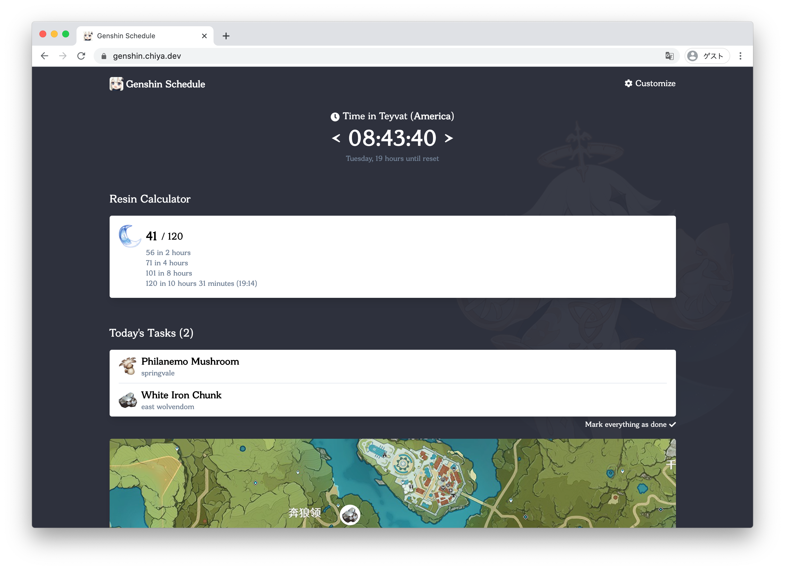

[English](README.md) | [简体中文](README_zh_CN.md)

# Genshin Schedule

Genshin Schedule is a website to help you keep track of time-related game activities in Genshin Impact.

For more information, visit [genshin.chiya.dev](https://genshin.chiya.dev).

## Contributions welcome!

The original author of this website ([phosphene47](https://github.com/phosphene47)) does not have much time to continue its development except for occasional database updates to stay up-to-date with the game. New feature implementations and bug fixes will be accepted via [pull requests](https://github.com/chiyadev/genshin-schedule/pulls), which are usually reviewed and merged within a week.

## Translations

We use [Weblate](https://hosted.weblate.org/projects/genshin-schedule/) for translations; see [here](https://github.com/chiyadev/genshin-schedule/blob/master/web/langs/README.md) for more information.

## Building from source

This website consists of two subprojects: [web](web) and [sync](sync)

- `web` frontend serving the website assets
- `sync` backend handling API requests

Navigate to the respective subproject directories for a detailed build procedure.

You may use the provided Dockerfiles ([web](Dockerfile.web) and [sync](Dockerfile.sync)) to generate production images.
